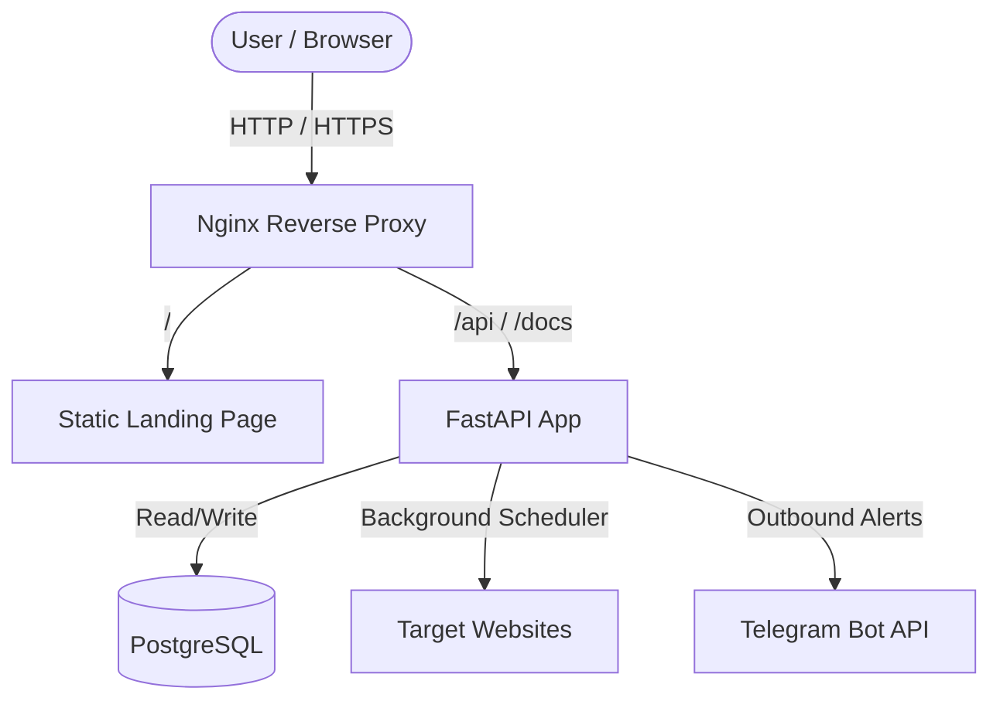

# Uptime Monitor

A lightweight, self-hosted website monitoring service that runs in Docker and sends real-time status updates directly to your Telegram chat. 

## Features

* **Asynchronous Scheduling**: Background workers run concurrent HTTP check tasks using Python's asyncio loop without interfering with API endpoint traffic.
* **Smart Alerting**: The system compares the latest check result with the database history. Telegram alerts are only dispatched when a site changes state (Up to Down, or Down to Up), preventing notification spam during a prolonged outage.
* **Bypass Bot Filters**: Request clients mimic browser headers to prevent Cloudflare and other bot-prevention firewalls from blocking monitoring pings with false 403 responses.
* **Static Landing Page**: A clean, single-page UI served directly by Nginx at the root domain that displays infrastructure configurations and links to the API documentations.
* **Database migrations**: Configured with Alembic to handle safe schema updates as the application grows.

## System Architecture

The application runs as a multi-container Docker Compose application behind an Nginx reverse proxy:



* **Nginx**: Operates as the entry point, serving static frontend files and routing API traffic to the backend application container.
* **FastAPI App**: Exposes the REST API, runs CRUD operations, and manages the background pinger loop.
* **PostgreSQL**: Stores site configurations and historical availability logs.
* **Certbot**: Handles automatic Let's Encrypt certificate generation and renewal.

## Local Development

To run this project locally, you will need Docker and Docker Compose installed.

Clone the repository and create your local environment file:
```bash
cp .env.example .env
```

Open the `.env` file and configure your database credentials. You can leave the Telegram variables blank if you just want to test the API locally without sending alerts.

Start the application containers:
```bash
docker compose -f compose/docker-compose.yml up -d --build
```

The application will spin up the database, apply any initial migration schemas, and start the web server. You can access the API documentation at `http://localhost:8000/docs` to register new sites and verify they are being tracked.

To view the real-time background logs of the pinger loop:
```bash
docker compose -f compose/docker-compose.yml logs -f app
```

### Running Tests

We write tests using Pytest and Pytest-Asyncio. The tests run against a local, temporary SQLite file database (`test_temp.db`) instead of PostgreSQL to keep the test environment isolated, lightweight, and fast.

To run the test suite inside the application container:
```bash
docker compose -f compose/docker-compose.yml exec app pytest tests/ -v
```

## Deployment & Production Setup

In production, the application is deployed on an Azure Virtual Machine (Standard_B1s) running Ubuntu.

The infrastructure setup is managed through two layers:
1. **Terraform**: Located in the `terraform/` directory. It provisions the VM, network security groups, and public IP address.
2. **Ansible**: Located in the `ansible/` directory. It installs Docker, configures Nginx directories, and configures the environment on the host machine.

### Let's Encrypt SSL Bootstrap

To resolve the chicken-and-egg problem where Nginx needs SSL certificate files to start, but Certbot needs a running Nginx server to verify the domain ownership, we use a custom initialization script:
```bash
bash scripts/init_ssl.sh
```
This script temporarily swaps Nginx to an HTTP-only configuration, triggers the Certbot registration, retrieves the SSL certificates, and then restores the production HTTPS Nginx configurations.

### Database Migrations in Production

When deploying to a server with an existing database, stamp the database with the initial migration state to prevent Alembic from attempting to recreate existing tables:
```bash
docker exec uptime-app alembic stamp 0001
```

## CI/CD Pipeline

The project uses GitHub Actions to automate quality checks and deployments:

* **Linting and Testing**: On every push and pull request, the pipeline installs dependencies, lints the codebase using Ruff, and runs the Pytest suite using the isolated SQLite configuration.
* **Automated Deployment**: When changes are merged into the `main` branch, the workflow connects to the Azure VM via SSH, pulls the latest code, rebuilds the Docker containers using `deploy.sh`, and runs a healthcheck script to verify the application is fully operational.

## API Documentation

Once the application is running, the API exposes standard endpoints to manage monitored sites:
* **Swagger UI**: `/docs`
* **ReDoc**: `/redoc`

You can use the API to register new sites, delete old configurations, list active checks, or review the historical ping results of any managed URL.

## Future Improvements

* **Database Log Rotation**: Setting up a periodic script to prune log entries older than 30 days to prevent PostgreSQL disk space exhaustion.
* **Custom Polling Intervals**: Extending the site configuration schema to allow customized check intervals per site instead of using a global interval.
* **Latency Profiling**: Adding response time averages and metrics to the static frontend page.

## Author

Created by Lahoda Dmytro in 2026. Released under the MIT License.
